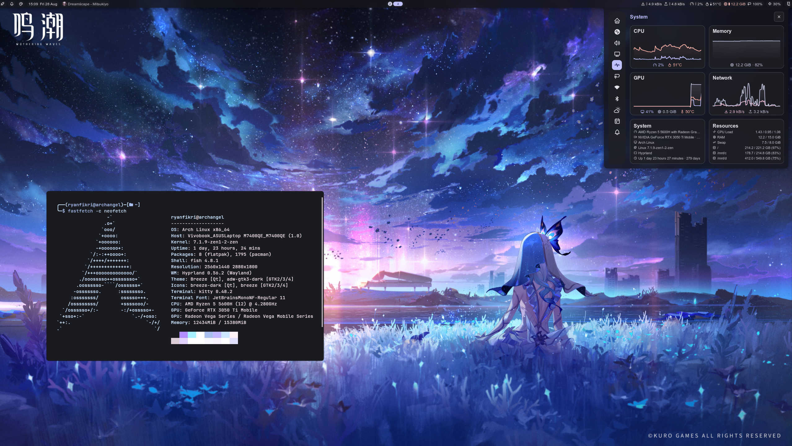

In the end of December 2024, after finishing my Bangkit's capstone project, I sit in front of my Laptop wondering what to do. Then I just randomly downloaded the Arch Linux ISO, create separate partition, and install it there. At the time, I just want to experiment and tweak the OS. Then, I install Hyprland as I kinda bored with ordinary desktop (and I often found gorgeous rice in r/unixporn :\)), little did I know that I'll almost never touch Windows for 2 years.

## Previous Experience
I actually tried Linux long before that, at around 2019/2020 during the Covid-19 Pandemic, one of my friends creates a WhatsApp Story in which he installs Ubuntu on his machine. Then, I tried to install one of Ubuntu derivative: Zorin OS, which seemed to have sleek interface and similar to Windows 10. Unfortunately, it never last long, it usually only last less than a week before back to Windows 10. I just can't get used to the interface.

Then, during my early college days, after I got a new Laptop. I tried to revisits Linux and try various distributions. I tried Ubuntu, Mint, elementary OS, retry Zorin OS, etc., but usually end up back to Windows 11 after few days. I just can't get the hang of it. Even though at that time I also love to customizing my Windows Desktop using tools such as Rainmeter, somehow I felt that customizing Linux still harder. My longest streak of daily-driving Linux was only around 2 weeks using Zorin OS.

## The Turning Point
As I mentioned in the beginning of this post. I tried Arch Linux on a whim without any intent of daily driving it. I remember that I spent nearly 4-5 hours just to get a usable desktop. But I captivated with the customizability of Hyprland and the unique workflow due to it being a tiling compositor. One day turned into a week, and one week turned into months. I was having fun customizing my desktop. I even created many obscure scripts to change the desktop behaviour that I never thought before, such as a script to automatically turn off just my Laptop screen (I have external monitor, and my built-in screen is an OLED) if the laptop is not in focus for a certain time, or a script that'll automatically unbind certain keybind if my VM window is focused. It's fun, and a realization kick in.

## Realization
I think my previous experience never lasts long because I was too focused on making it look and felt like Windows. Instead of learning the native tools and workflow, I always tried to find an alternative that mimics the behavior from Windows. I remember that I install many extensions on GNOME and rage quit when the extension clashes with each other or with updates. This time, I didn't do that. I embrace the behaviour and new workflow. It's refreshing and game changing. Although there're times when my installation broke due to silly mistakes, it's a great learning experience.

## Currently
It's been almost two years since I started daily-driving Arch Linux. I still keep my Windows 11 installation just in case my installation breaks and I can't boot into the OS (although I usually can fix it quickly with Chroot from live USB). It's a journey that I don't regret, and I'm excited to see what the future holds. Before I end my post, here's a screenshot of my desktop.

- Distro: Arch Linux
- Compositor: Hyprland
- Desktop Shell: Noctalia
- Terminal: Kitty
- Shell: Fish
- Shell Prompt: Starship
- Wallpaper: Just search "Shorekeeper Wuthering Waves" on Google